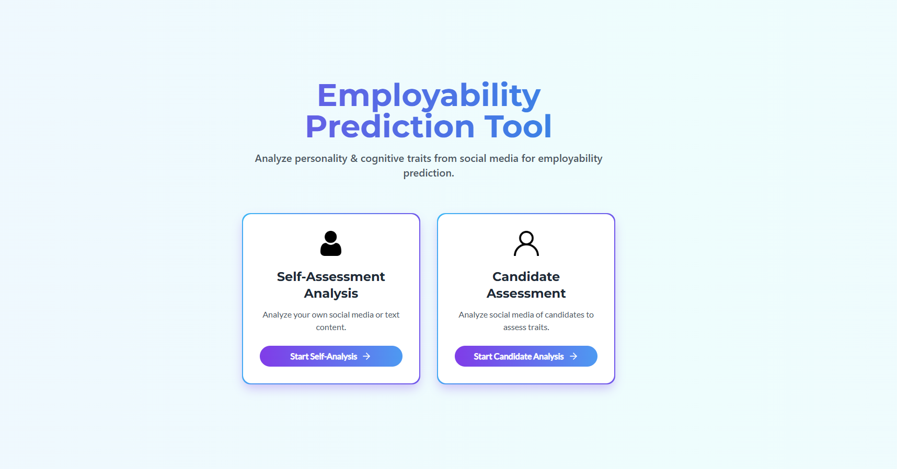
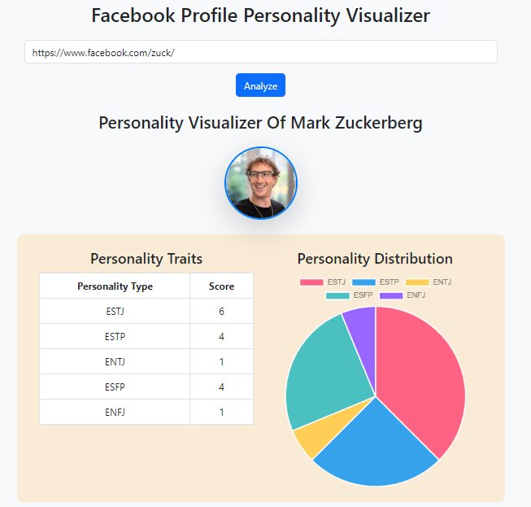
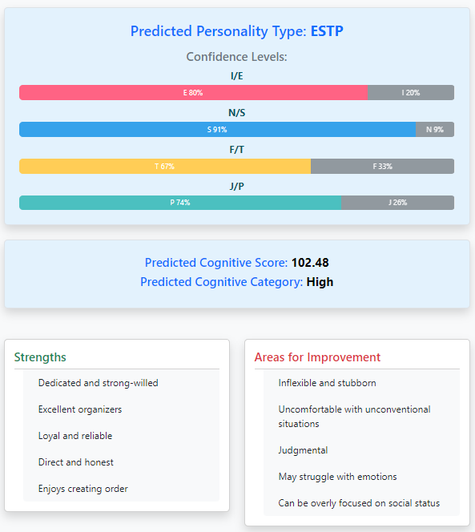
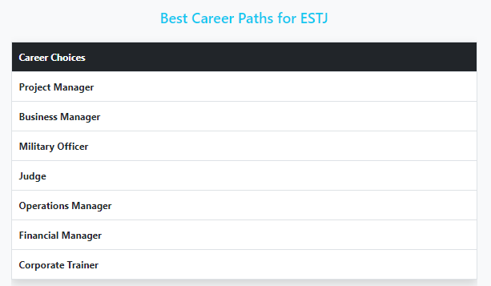

# Final Year Project TMSL CSE Group-26

## 🎯 Aim
Establish a relationship between personality traits, cognitive ability, and job proficiency by analyzing social media content using machine learning models.

---

## 👩‍🏫 Group Mentor
**Mrs. Nairanjana Chowdhury**

---

## 👨‍💻 Group Members
1. [Pinaki Banerjee](https://www.linkedin.com/in/pinaki-358083262/)
2. [Anuvab Chakravarty](https://www.linkedin.com/in/anuvab-chakravarty-001b39233/)
3. [Debanjan Konar](https://www.linkedin.com/in/debanjan-konar/)
4. [Soumyajit Dey Sarkar](https://www.linkedin.com/in/soumyajitds/)

---

## 📦 Project Structure

```
project-root/
├── README.md
├── screenshots/
│   ├── web_ui.jpg
│   ├── split_terminal.jpg
│   ├── analysis_1.jpg
│   ├── analysis_2.jpg
│   └── analysis_3.jpg
├── Deliverables/
│   ├── app.py
│   ├── api.py
│   ├── requirements.txt
│   ├── model/
│   ├── static/
│   └── templates/
└── Misc/
```

---

## 🔗 [Project Resources](https://drive.google.com/drive/u/0/folders/1kyYzn2HnSyKTw66ZcAmA5XLbtThY2Myi)

---

## 🧠 Features

- Automated scraping of Facebook posts (text & image OCR)
- MBTI-based personality prediction using ML models
- Cognitive score derivation from personality data
- Job recommendation based on cognitive-employability linkage
- Web-based UI with real-time analysis display

---

## ⚙️ Installation Guide

### 1. 📥 Download the Project

Clone or download the entire project from Google Drive. You’ll get a folder structure with:
- `Deliverables/` (all code and assets)
- `Misc/` (any supporting data or documentation)
- `README.md` (you are reading it!)
- `screenshots/` (for UI reference)

### 2. 🔧 Install Dependencies

Navigate to the `Deliverables/` folder:
```bash
cd Deliverables
pip install -r requirements.txt
```

---

## 🚀 Running the System

### Step-by-step Instructions:

1. **Start the Frontend Server**  
   In one terminal:
   ```bash
   python app.py
   ```

2. **Start the Backend API**  
   Open a second terminal (or split the current one), then run:
   ```bash
   python api.py
   ```

   > ⚠️ Keep both terminals open; both servers must run in parallel.

   📸 _Terminal with both processes running:_

   

3. **Access the Web Interface**  
   Open your web browser and go to:
   ```
   http://localhost:8090/
   ```
   or
   ```
   http://127.0.0.1:8090/
   ```

   📸 _Web UI landing page:_

   

4. **Perform the Analysis**

   - Enter the **public Facebook profile link** in the input box.
   - Click on **Analyze**.
   - The application will:
     - Fetch posts,
     - Run OCR if images are present,
     - Predict MBTI personality,
     - Compute cognitive score,
     - Recommend job profiles.

   📸 _Sample Analysis Screenshots:_

   

   

   

---

## 🛠 Tech Stack

- **Language**: Python 3
- **Frontend**: Flask, HTML, CSS
- **Backend**: Flask API, scikit-learn, Selenium
- **Libraries**: OpenCV, pytesseract, pandas
- **Deployment**: Localhost

---

## 📬 Contact

Feel free to connect for queries or collaboration:

- [Pinaki Banerjee](https://www.linkedin.com/in/pinaki-358083262/)
- [Anuvab Chakravarty](https://www.linkedin.com/in/anuvab-chakravarty-001b39233/)
- [Debanjan Konar](https://www.linkedin.com/in/debanjan-konar/)
- [Soumyajit Dey Sarkar](https://www.linkedin.com/in/soumyajitds/)

---

_Thank you for exploring our project!_
